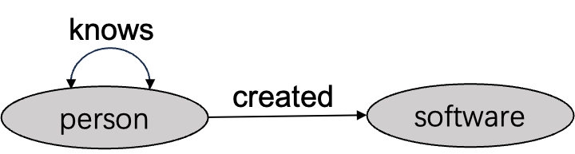

# Overview

## What is Cypher?

Cypher is a declarative graph query language designed specifically for graph databases. It provides an intuitive and expressive way to query, manipulate, and manage graph data. Our implementation is based on the [OpenCypher](https://opencypher.org/) specification, which is an open standard for graph query languages.

## Key Differences from SQL

While SQL is designed for relational databases with tables and rows, Cypher is optimized for graph databases with nodes, relationships, and properties:

- **Structure**: SQL uses tables and joins; Cypher uses nodes, relationships, and patterns
- **Pattern Matching**: SQL requires explicit joins; Cypher uses pattern matching syntax
- **Traversal**: SQL requires complex joins for multi-hop queries; Cypher naturally supports path traversal
- **Readability**: Cypher's ASCII art syntax makes graph patterns visually intuitive

## What Can You Do with Cypher in NeuG?

In NeuG, we refer to a Cypher query as a **Statement**. A Statement consists of multiple **Clauses**. For example, in the following query:

```cypher
MATCH (p:person)
WHERE p.age = '29'
RETURN p.name as name;
```

The `MATCH`, `WHERE`, and `RETURN` components are called Clauses, which are the fundamental logical units for graph database operations.

Based on OpenCypher, we have defined a series of Statement syntax for managing NeuG's graph database, including:

### Schema Management (DDL)

NeuG primarily targets Schema-Strict graph data scenarios, where every piece of data must conform to predefined schema specifications. This is similar to traditional SQL; however, graph data involves more complex node and relationship structures that must also comply with predefined schema requirements.

For example, consider the following schema graph:



The above schema graph can be created by the following statements:

```cypher
// Example schema definition
CREATE NODE TABLE person (
    name STRING,
    age INT32,
    PRIMARY KEY (name)
);

CREATE NODE TABLE software (
    name STRING,
    lang STRING,
    PRIMARY KEY (name)
);

CREATE REL TABLE knows (
    FROM person TO person,
    weight DOUBLE
);

CREATE REL TABLE created (
    FROM person TO software,
    weight DOUBLE
);
```

**Schema-compliant query:**
In the following query, the vertex label `person` and edge label `(person-knows->person)` both conform to the schema constraints defined above. The `person` node contains `age` and `name` properties, and the `age` property is of type INT32, which is comparable to the constant 18. Therefore, this query satisfies all schema constraints and is valid:

```cypher
MATCH (p:person)-[:knows]->(f:person)
WHERE p.age > 18
RETURN p.name, f.name;
```

**Non-schema-compliant query (would fail):**
The edge label `(person-follows-> person)` specified in this query does not exist in the schema, making it invalid and resulting in a "Table `follows` does not exist" error.

```cypher
MATCH (p:person)-[:follows]->(m:person)
RETURN p.name;
```

We define a set of syntax for creating schema graphs as shown above, which we call DDL (Data Definition Language). All subsequent data updating and query operations must conform to the schema specifications defined by the current DDL. We will introduce this in detail in the [DDL section](ddl_clause.md).

### Data Query (DQL)

We also define a set of query syntax that can satisfy both Transactional Processing (TP) and Analytical Processing (AP) query requirements.

For example, you can query all triangle patterns in the graph database using the following query:

```cypher
MATCH (a:person)-[:created]->(b:software),
      (c:person)-[:created]->(b:software),
      (a:person)-[:knows]->(c:person)
WHERE a.name < c.name
RETURN a.name, b.name, c.name;
```

We refer to each `MATCH`, `WHERE`, and `RETURN` as a Clause, which are the basic units of graph data operations. Here, the `MATCH` operation primarily matches all data that constitutes triangle patterns, `WHERE` further filters the pattern data to guarantee deduplication, and `RETURN` operations perform projection of names and output the final results. The `MATCH` operation mainly completes graph pattern matching, while `WHERE`/`RETURN` operations primarily perform relational operations similar to SQL. These clauses will be introduced in detail in [DQL section](query_clauses/index.md).

To further ensure the legality of Clause operations on data, we have defined the data type boundaries that NeuG supports, as well as expression operations based on these data types. These will be introduced in detail in the [Data Types](data_types.md) and [Expressions sections](expression/index.md).

### Data Management (DML)

In addition to DQL and DDL, NeuG also supports data update functionality, which we refer to as DML (Data Manipulation Language). DML operations can be performed through bulk loadings or incremental updates.

**Bulk import example:**
```cypher
COPY person FROM `person.csv`;
COPY knows FROM `knows.csv`;
```

The above two Statements first bulk load node data with label `person` from person.csv, then bulk load edge data with label `person-[knows]->person` from knows.csv.

**Incremental update example:**

We also provide incremental write syntax for incrementally updating graph data.

**Node creation example:**
```cypher
CREATE (p:person {name: 'Bob', age: 30});
```

**Relationship creation example:**
```cypher
MATCH (a:person {name: 'Bob'}), (b:person {name: 'marko'})
CREATE (a)-[:knows {weight: 3.0}]->(b);
```

**Node deletion example:**
```cypher
MATCH (p:person {name: 'Bob'})
DELETE p;
```

We will introduce these DML operations in detail in the [DML section](dml_clause.md).
